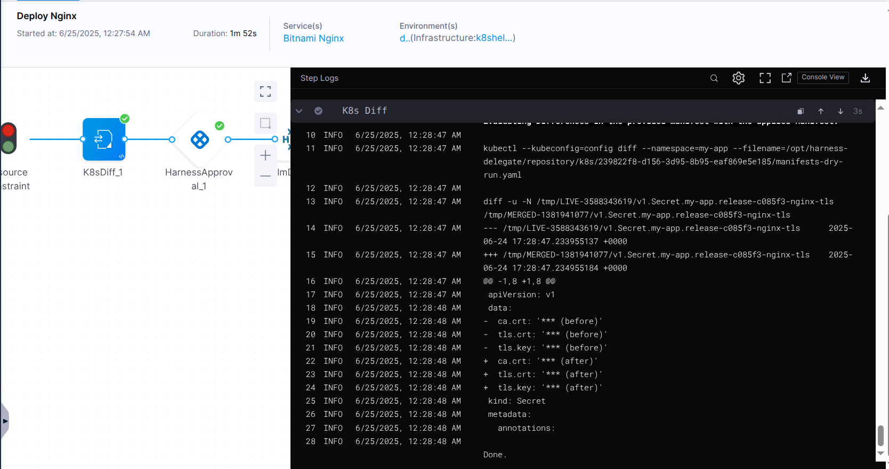

# Lab

## Enable Kubernetes Diff Preview in Day 8 Pipeline

### Add diffutils tool to delegate image

Because K8S Diff Step require the **diffutils** package installed on the system to use the kubectl diff command, I need to add this package to **delegate image**.

Open the **delegate YAML file** and locate the `INIT_SCRIPT` in the delegate container spec. To install additional tools on the delegate, add custom scripts to the `INIT_SCRIPT`.

```yaml
  - name: INIT_SCRIPT
    value: |
        microdnf install -y diffutils
```

Apply the changes

```yaml
kubectl apply -f harness-delegate.yml
```

### Add K8S Diff Step to day8-cd-pipeline

