# Learning

## Harness Platform

The Harness Platform provides a common framework underlying the Harness modules to help you onboard and enable diverse teams leveraging different modules for different use cases.

### Secrets management

Harness includes built-in secrets management to store your encrypted secrets, such as access keys, and use them in your Harness account. Harness also integrates with all popular secrets managers.

### Delegates

Harness Delegates are lightweight worker processes that you install on your infrastructure (such as a Kubernetes cluster). Delegates connect to the Harness Platform (also referred to as the Harness Manager) to perform tasks using your container orchestration platforms, artifact repositories, monitoring systems, and so on. Delegates communicate only via outbound HTTP/HTTPS to the Harness Platform.

This enables the Harness Platform to leverage the delegate to execute Harness tasks on your behalf, without any of your secrets leaving your network.

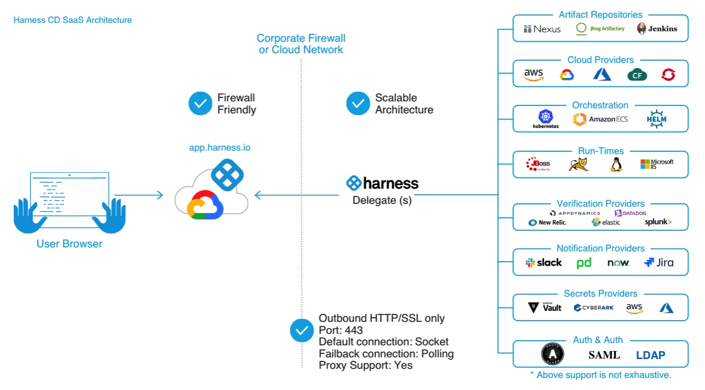

The delegate connects to Harness Manager (via SaaS) over a Secure WebSockets channel (WebSockets over TLS). The channel is used to send notifications of delegate task events and to exchange connection heartbeats. The channel is not used to send task data itself.

Harness uses delegates for all operations. For example:

Connectors: Connectors are used for all third-party connections.
Pipeline Services and Infrastructure: Connectors are used in Pipeline Service connections to repos and Pipeline Infrastructure connections to target environments (deployment targets, build farms, etc).
Pipeline Steps: You can select a delegate in each pipeline step to ensure that the step only uses that delegate to perform its operation.


### Connectors

Harness connectors contain the information necessary to integrate and work with 3rd party tools. For example, a GitHub connector authenticates with a GitHub account and repo and fetches files as part of a build or deploy stage in a pipeline.

### Pipelines

Pipelines are a feature of several Harness modules. Pipelines represent a workflow, and, in Harness, they are comprised of pipeline-level settings, stages, and steps. Pipelines can be a cyclical process that include integration, delivery, operations, testing, deployment, real-time changes, and monitoring.

For example, a pipeline can use the CI module to build, test, and push code, and then a CD module to deploy the artifact to your production infrastructure.

Pipelines are triggered manually in the Harness Platform or automatically in response to Git events, schedules, new artifacts, and so on.

#### Stages

A stage is a subset of a pipeline that contains the logic to perform one major segment of the pipeline process. Stages are based on the different milestones of your pipeline, such as building, approving, and delivering.

Some stages, like a deploy stage, use strategies that automatically add the necessary steps.

#### Steps and step groups

A step is an individual operation in a stage. Harness offers many steps, from specialized steps to generic scripting steps.

Steps can run sequentially or in parallel. You can also organized related steps into step groups.

Usually, a step group is a collection of steps that share the same logic, such as the same rollback strategy.

## Harness Continuous Integration

### Workflows as pipelines

In Harness CI, you model your build and test workflows in pipelines. Within pipelines, work is divided into stages. Each stage can include steps that build and test code, upload artifacts, send notifications, and more. You can run pipelines manually or set up automated triggers.

CI pipeline steps run as containers, making it language-agnostic. Containers are lightweight abstractions of the host operating system that can package code and dependencies independently of the steps. You can specify a container in the pipeline itself, and the agent will fetch and start the container where the job runs. Because all the steps run in containers, and plugins have their own containers, you don't need to worry about dependencies.

### Harness CI architecture

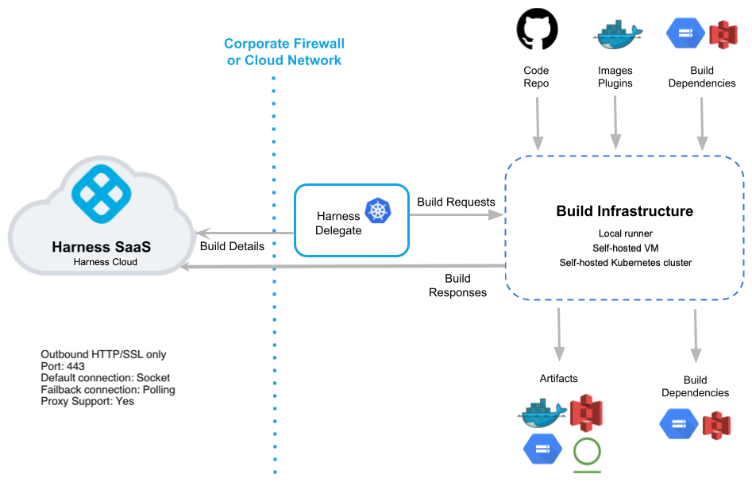

The Harness Delegate is central to CI processes and is in charge of CI operations. It runs in your environment, such as your local network, virtual private cloud, or cluster.

The delegate connects the Harness Manager in your SaaS instance to all of your code repositories, artifacts, infrastructure, and cloud providers.

## Harness Continuous Delivery (CD) and GitOps 

Harness Continuous Delivery (CD) and GitOps enables deployment of application and infrastructure changes in a safe and sustainable way. Your CD pipelines and GitOps workflows can automate all of the steps necessary to get your changes into production.

### Key Concept

| Generic CD workflow concept | Harness CD concept|
|-----------------------------|-------------------|
| What you deploy             | Service and Service Definition |
| Where you deploy it         | Environment and Infrastructure Definition |
| How you deploy it	          | Steps and Failure Strategy |
| When you deploy it          | Triggers |
| Who approves the deployment | Approval Steps and Stages |

#### Deployments

Deployments make developed artifacts available for use in test or production. They release applications for access by users or systems, and can be manual or automated. In Harness pipelines, deployments are modeled using services, environments, and execution steps.

#### Service

A Harness Service is a logical construct that represents your microservices and other workloads. Each Service can be deployed, monitored, or changed independently.

#### Environment

Environments represent your deployment targets logically (QA, Prod, etc). You can add the same Environment to as many Stages as you need.

#### Pipeline

A CD Pipeline is a series of Stages where each Stage deploys a Service to an Environment. It can perform many additional CD operations

#### Stage

A CD Stage is a subset of a Pipeline that contains the logic to perform one major segment of the deployment process. Stages are based on the different milestones of your release process, such as dev, qa, and prod releases, and approvals.

#### Step

Steps perform the CD operations like applying a manifest, asking for approval, rollback, and so on. Harness automatically adds the steps you need for the deployment strategy you select. You can then add additional steps to perform many other operations. You can run steps in parallel and apply execution conditions and failure strategies to them individually or as step groups.

# Lab

## Create Harness account and Project 


## Install a Harness Delegate in Kind Cluster

**Prerequisite:** a local Kind Cluster

**Step 1:** Download the Delegate YAML from Harness UI:

- **Account Settings -> Delegates -> New Delegate**

- Where to install: **Kubernetes -> Kubernetes Manifest -> Basic**

- Download YAML

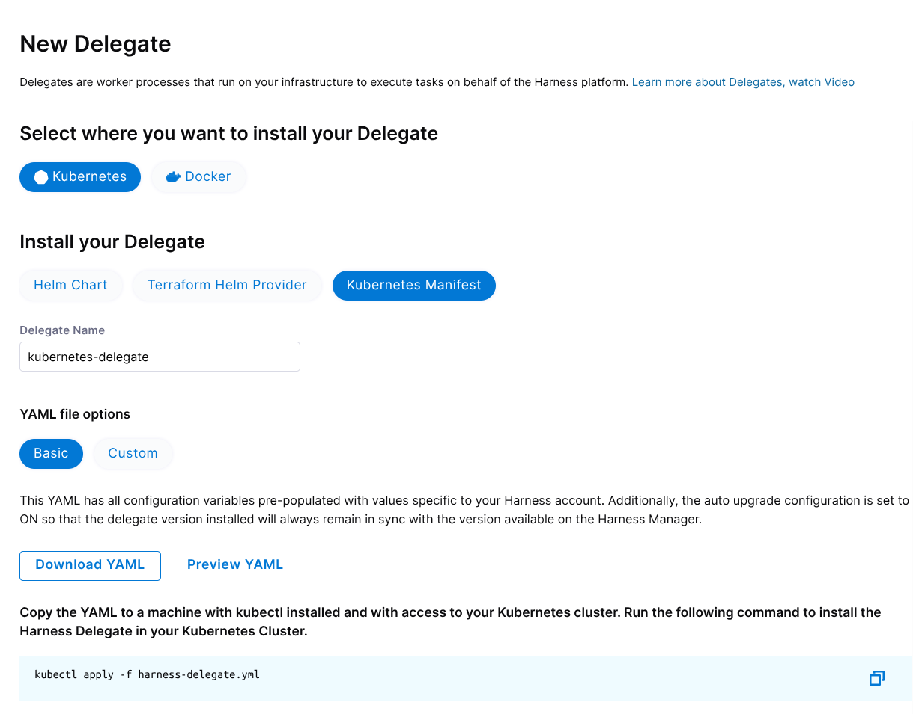

**Step 2:** Run command to install Delegate in K8S Cluster.

```bash
kubectl apply -f harness-delegate.yml
```

**Step 3:** Verify Delegate connection to Harness Manager

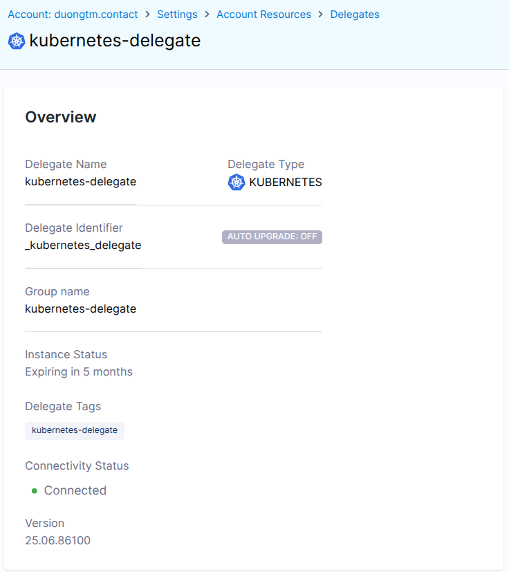

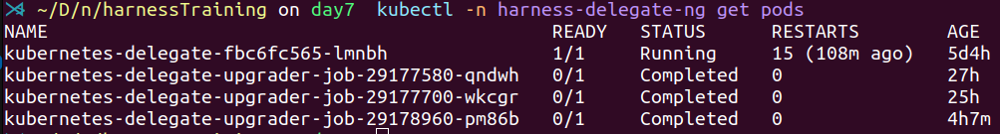

## Set up a GitHub connector

**Prerequisite:** 

- A Github account.
- A PAT for github authentication.
- A Github repository.

**Step:** Account Settings -> Connectors -> New Connector -> Github

**Note:**

- URL Type: Repository

- Enable API access

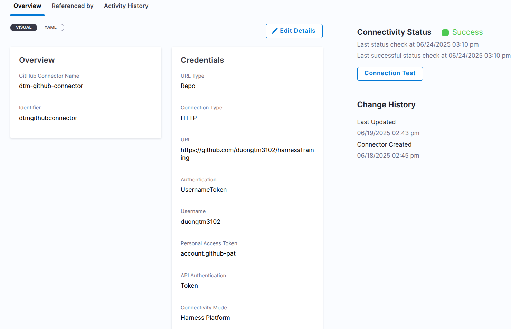


## Set up a Docker connector

**Prerequisite:** 

- A Dockerhub account.
- A PAT for Dockerhub authentication.

**Step:** Account Settings -> Connectors -> New Connector -> Github

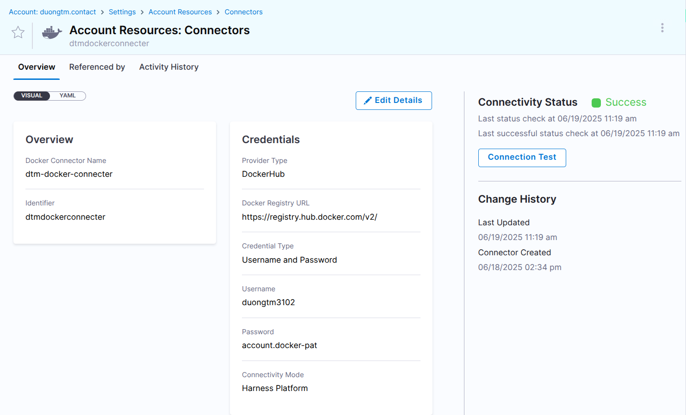

## Create a CI Pipeline

**Step 1:** Create pipeline

- In Project -> **Pipelines**

- Create a Pipeline

**Step 2:** Add Stage

- **Stage:** Build

- **Configure Codebase:** Use the Github connector created.

- **Infrastructure:**

    Create a K8S connector. The connector inherits the credentials used by the Harness Delegate running in Kind cluster.

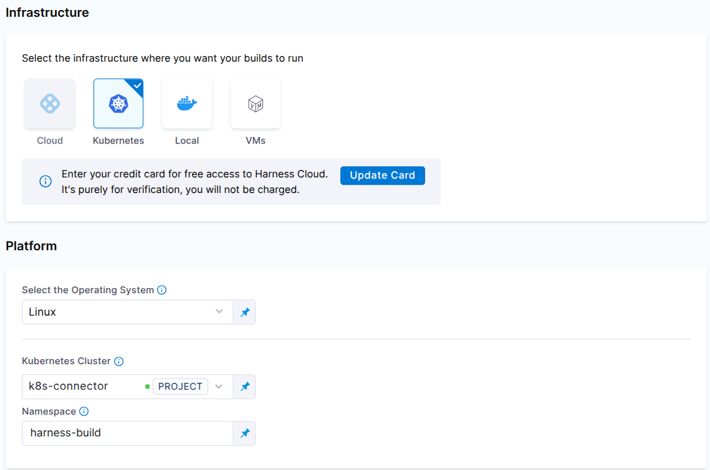

**Step 3:** Add Step

- **Step:** Build and Push an image to Docker Registry

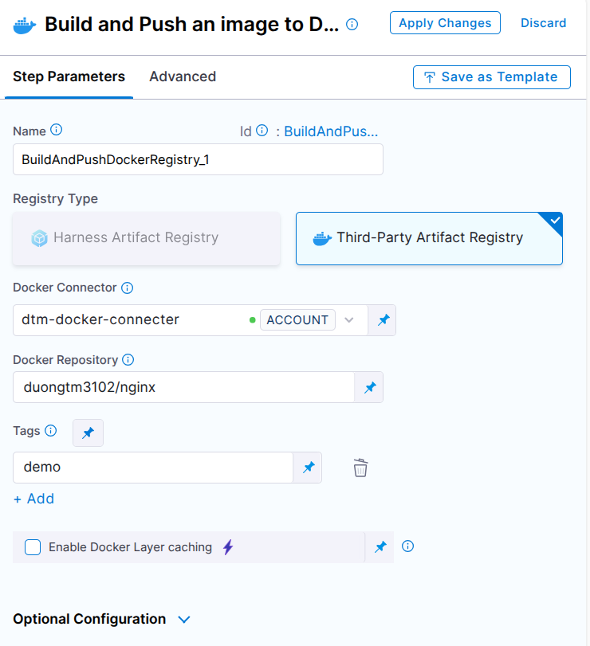

**Step 4:** Run pipeline

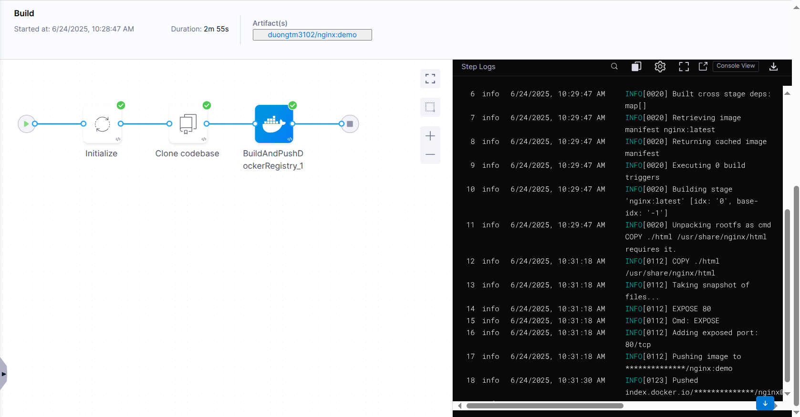

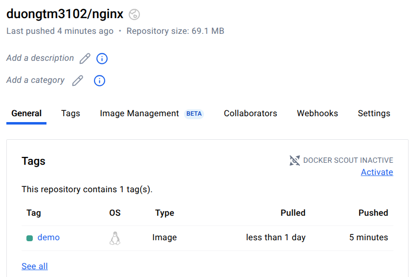

