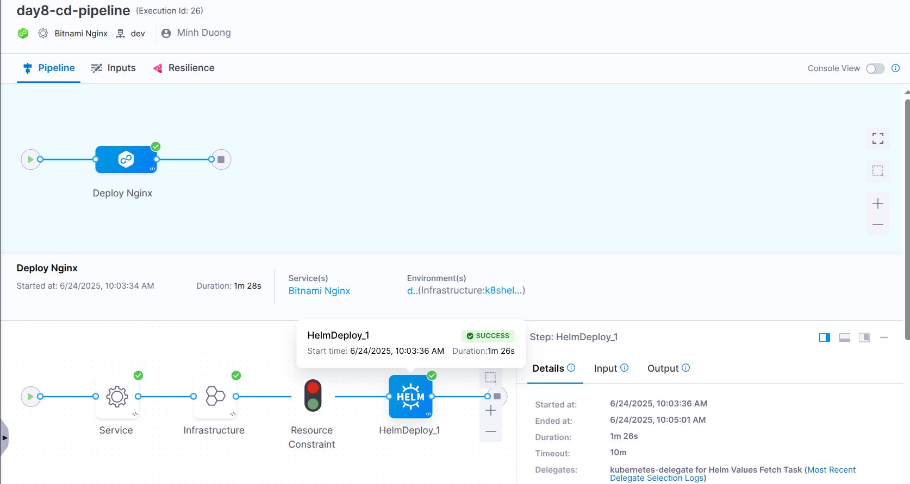
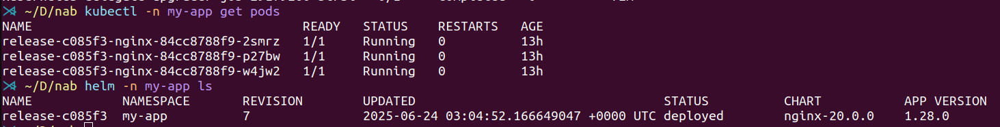
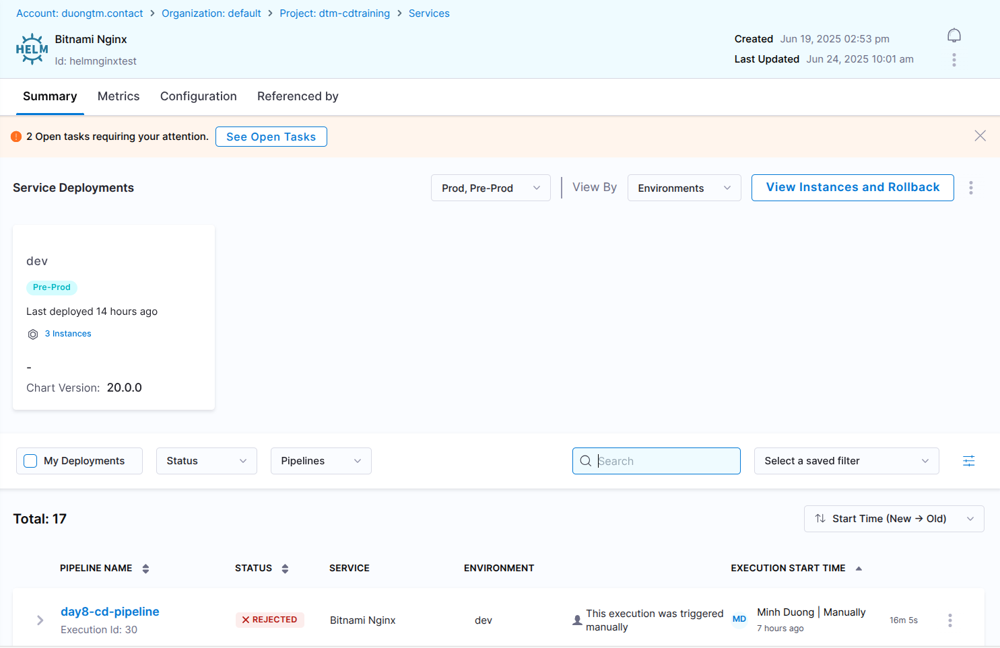
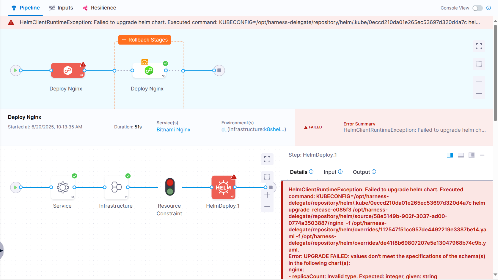
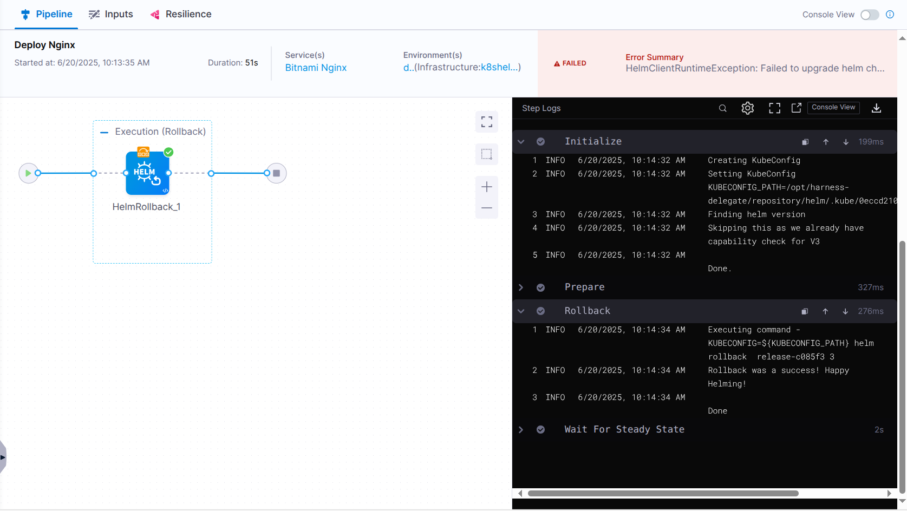

# Lab

## Create Service

**Services -> New Service**

**Name:** Bitnami Nginx

**Deployment Type:** Native Helm

**Manifest Source:** Create A Helm Repo Connector (https://charts.bitnami.com/bitnami)

**Manifest Details:**

- **Manifest Identifier:** nginxhelm

- **Chart Name:** nginx

- **Chart Version (optional):** 20.0.0

- **Helm Version:** Version 3

## Set up a Harness Environment

**Environments -> New Environment**

- **Name:** dev

- **Environment Type:** Pre-Production

### Create an Infrastructure Definition

**Name:** k8s-helm-infra

**Deployment Type:** Native Helm

**Infrastructure Type:** Kubernetes

**Cluter Details:** 

- **Connector:** k8s-connector

- **Namespace:** my-app

## Create CD pipeline to deploy Nginx Helm chart

In CD module, go to **Pipelines -> Create a Pipeline**

**Name:** day8-cd-pipeline

**Add Stage:** Deploy

- **Deployment Type:** Native Helm

- **Service:** Bitnami Nginx

- **Environment:** dev

- **Infrastructure:** k8s-helm-infra

- **Execution:** Rolling Strategy

- **Failure Strategy:** All Errors -> Rollback Pipeline

## Run pipeline and check result

## Service and Environment created in previous section

## Simulate a failed deployment (Invalid input value for Helm Chart)

**Pipeline logs**

**Rollback Stage Logs**

