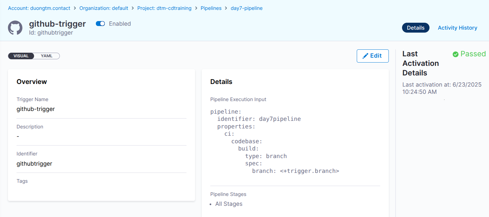
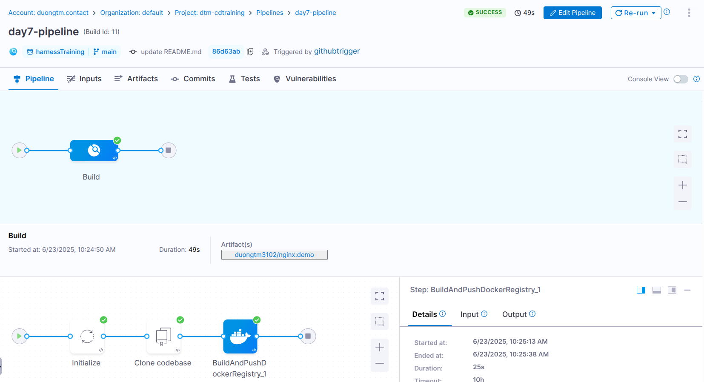
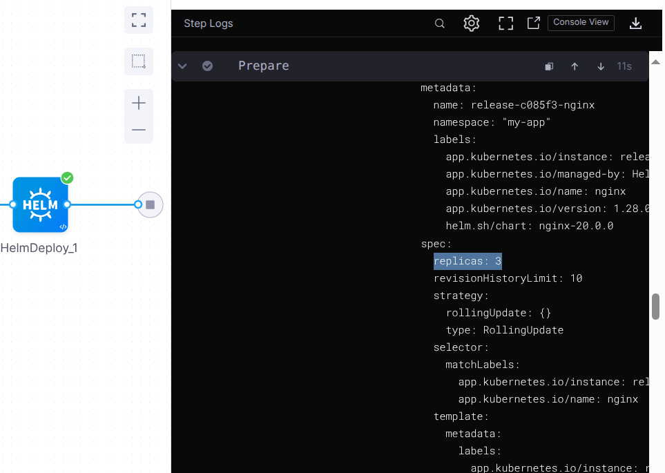

# Learning

## Trigger

Harness uses triggers as a core component to automate and streamline deployment workflows. Triggers help you automate the execution of your pipelines based on some event like a new artifact/manifest, or run on a schedule or an external webhook. Triggers offer a versatile and dynamic approach to initiating processes based on specific events, changes, or conditions in pipelines.

### Types of triggers

There are four trigger types in Harness:

- **Webhook:** Trigger Harness pipelines in response to Git events that match specific payload conditions you set up in a Harness trigger. 

- **Artifact:** Trigger Harness pipelines in response to a new artifact version being added to a registry.

- **Manifest:** Trigger Harness pipelines in response to a new Helm chart version being added to an HTTP Helm repo. 

- **Scheduled:** Schedule Harness pipeline executions using Cron-based triggers. 

## Harness secrets management 

Harness includes a built-in Secret Management feature that enables you to store encrypted secrets, such as access keys, and use them in your Harness account. Some key points about Secret Management:

- Secrets are always stored in encrypted form and decrypted when they are needed.

- Harness Manager does not have access to your key management system, and only the Harness Delegate, which sits in your private network, has access to it. Harness never makes secret management accessible publicly. This adds an important layer of security.


# Lab

## Create a trigger for Day 7 CI pipeline

In CI Module, go to **Pipelines** -> choose **day7-pipeline**.

Select **Triggers** -> **New Trigger**

Choose **Github Webhook**:

- **Name:** githubtrigger

- **Lisen on New Webhook:**

  - **Connector:** dtm-github-connector (The github connector created in day 7)

  - **Event:** Push

  - ***Configure Secret*** (*optional, for the secret to work with the webhook, you need to configure the repository webhook with the same secret.)*

- **Conditions:**

  - **Branch Name** Equals **main**



## Test trigger

Push a change to **main** branch of github repository.

Check pipeline execution history.



## Add a pipeline variable to Day 8 CD Pipeline

    Add replica_count variable to customize the Nginx chart's replicaCount.

**Step 1:** Add variable to pipeline 

In CD module, go to **Pipelines** -> **day8-cd-pipeline**

In **Variables**, Add a custom variable:

- **Type:** Number

- **Name:** replica_count

- **Value:** Runtime input

**Step 2:** Add an Additional Override File to Nginx (Harness) Service.

Edit **Bitnami Nginx Service**

In **Manifests**, **Add Additional Override File**:

- **Manifest Type:** Values YAML

- **Source:** Harness or fetch from Git repo ...

- **File content:**

```yaml
replicaCount: <+pipeline.variables.replica_count>
```

## Run CD pipeline with variable


With replica_count = 3, Helm deploy 3 Nginx pods

